# Introduction To OwLite

This guide gives a detailed introduction to the basics of OwLite and it's capabilities. [ResNet18](https://arxiv.org/abs/1512.03385) for image classification is used as an example, but the same principles can be applied to other models and tasks. Complete code can be found in `introduction.py`.

1. Firstly, code is set up using standard PyTorch code. Here let's load ResNet18 model using the [torchvision library](https://pytorch.org/vision/main/models/generated/torchvision.models.resnet18.html) with the default ImageNet trained weights.

        import torch
        from torchvision.models import resnet18

        device = "cuda:0" if torch.cuda.is_available() else "cpu"
        model = resnet18(weights="DEFAULT")
        model.to(device)

        

2. Now let's add the required OwLite functions. Documentation for each function can be found here; [init](https://squeezebits.gitbook.io/owlite/python-api/owlite.owlite.init), [convert](https://squeezebits.gitbook.io/owlite/python-api/owlite.owlite.owlite/owlite.owlite.convert), [export](https://squeezebits.gitbook.io/owlite/python-api/owlite.owlite.owlite/owlite.owlite.export), [benchmark](https://squeezebits.gitbook.io/owlite/python-api/owlite.owlite.owlite/owlite.owlite.benchmark).

        import owlite

        owl = owlite.init(project="Introduction", baseline="resnet18", experiment=experiment)

        dummy_input = torch.randn(batch_size, 3, 224, 224)
        model = owl.convert(model, dummy_input)

        owl.export(model) # Export model to ONNX
        owl.benchmark() # Benchmark model

3. The code can now be run inside the provided docker container. Instruction to setup the container can be found [here](../README.md).

        ./start_owlite
        cd introduction/ && python introduction.py

4. After completion benchmarking information will be displayed, along with other useful process information.

       OwLite [INFO] Baseline: resnet18
              Latency: 2.94397 (ms) on NVIDIA RTX A6000
              For more details, visit https://owlite.ai/project/detail/2ceca669a6a29b27884a97ab

5. Following the link provided by OwLite output allows for the results of the ResNet18 model to be viewed.

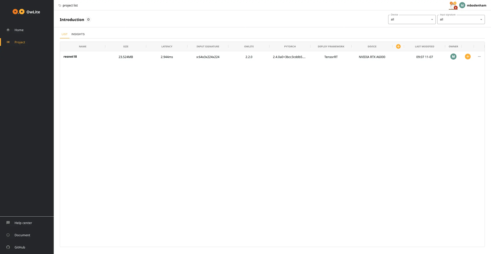

6. Clicking on the orange ⊕ at the end of the ResNet18 row allows us create a quantization experiment. Input `first_quantization` for the experiment name and click Enter.

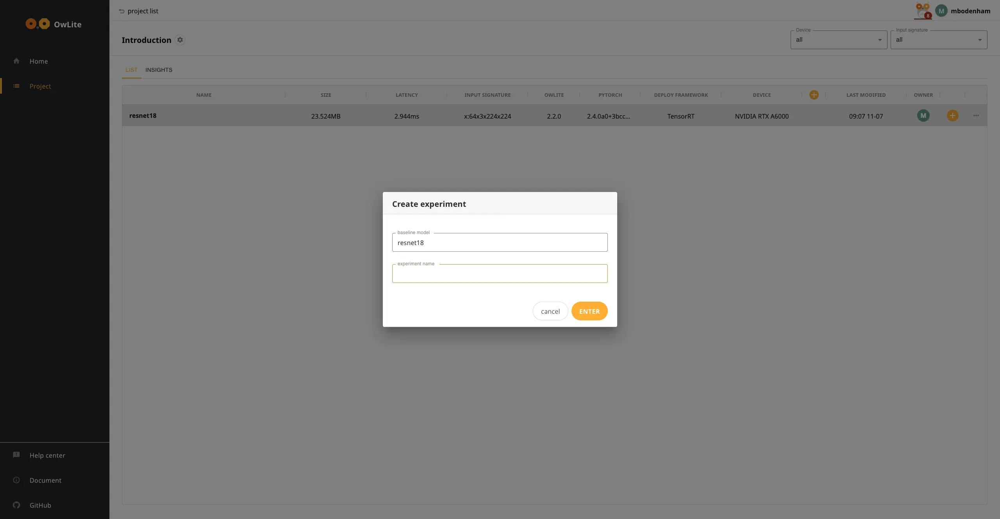

7. The next page shows an overview of the models architecture. Here the quantization setting of each layer can be adjusted, but lets use the recommended settings for this introduction.

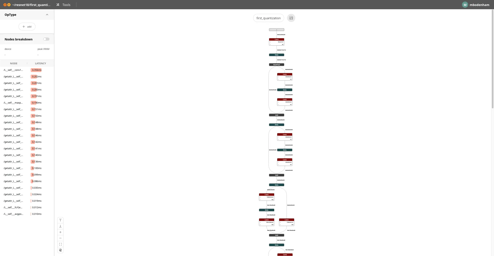

8. To quantize the model using the recommended setting; Go Tools → Recommended setting.

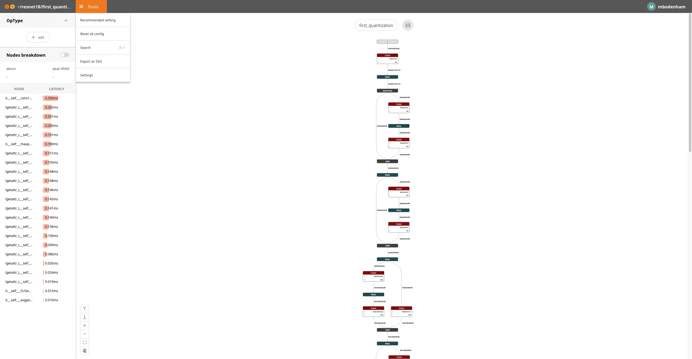

9. Confirm by clicking TRUST ME!

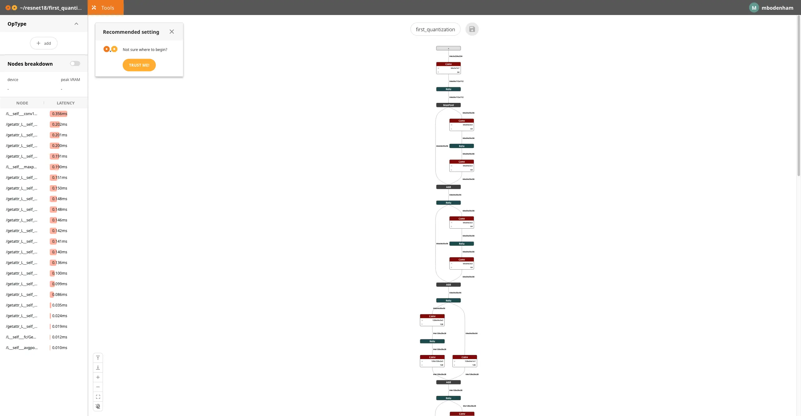

10. The recommended quantization setting have been loaded.  Click the orange save icon at the top of the model to save this setup.

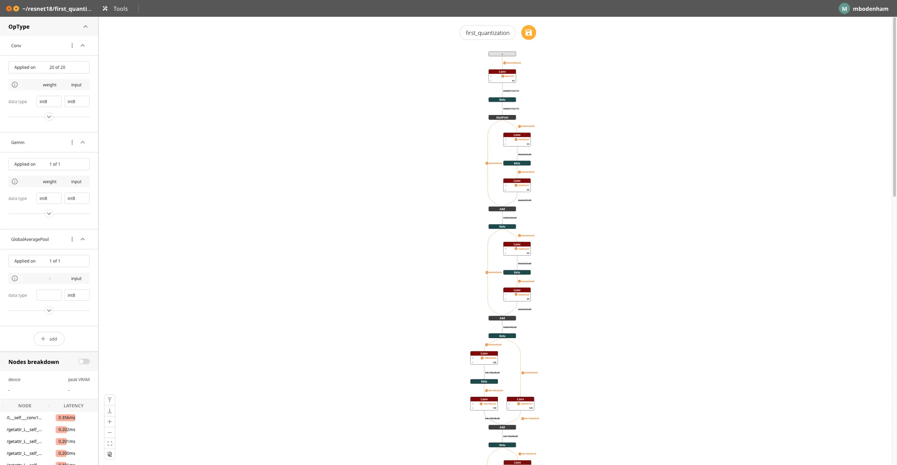

11. Here the quantization has been saved and can now be tested by updating `introduction.py`.

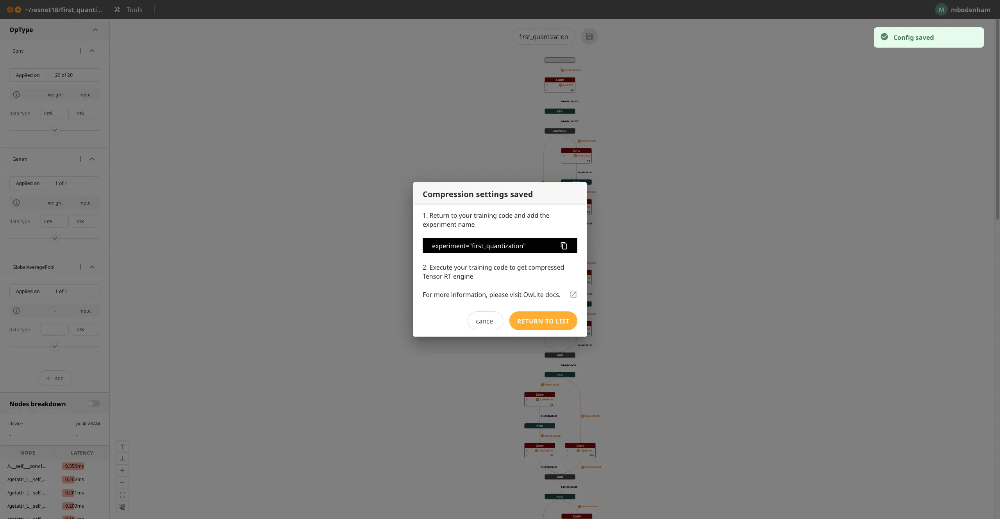

12. Let's add the experiment to `introduction.py` by updating the `owlite.init` function.

        experimnet = "first_quantization"

13. Run the experiment.

        python introduction.py

14. After the code has completed, the results of the quantization experiment can be seen on the OwLite dashboard.

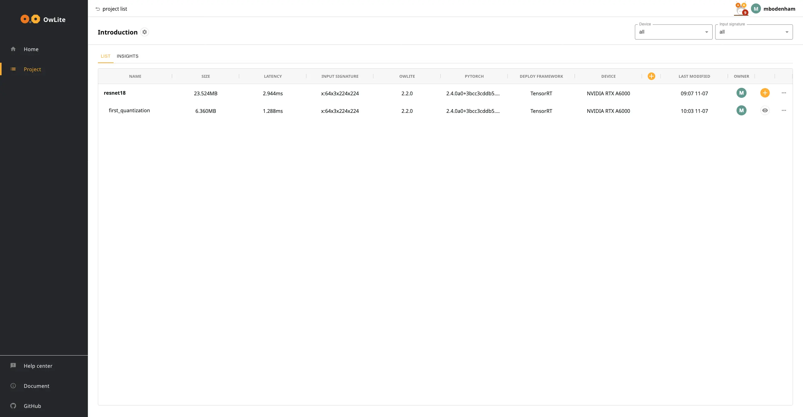

The recommended setting produce a **73% reduction in memory** and **2.3x speed up in inference latency**. Up to this point the models accuracy has not be considered.

## Testing Accuracy With Post Training Quantization (PTQ)

With a few more lines of OwLite code we can test the model's accuracy to be sure the model is still effective at performing its task.

ImageNet validation dataset is used to test ResNet18 for validation, [torchvision.datasets.ImageNet](https://pytorch.org/vision/main/generated/torchvision.datasets.ImageNet.html#torchvision.datasets.ImageNet). Files from the ImageNet 2012 dataset from the [official website](https://image-net.org/challenges/LSVRC/2012/2012-downloads.php), `ILSVRC2012_devkit_t12.tar.gz` and `ILSVRC2012_img_val.tar` are required for validation. See the [data folder](data/README.md) for instruction on preparing the files. The complete validation code can be found in `validate.py`.

15. First let's load the ImageNet dataset using PyTorch and apply the recommend image transforms.

        normalize = transforms.Normalize(mean=[0.485, 0.456, 0.406],
                                         std=[0.229, 0.224, 0.225])
        transforms = transforms.Compose([transforms.Resize(256),
                                        transforms.CenterCrop(224),
                                        transforms.ToTensor(),
                                        normalize])

        val_dataset = ImageNet(root='./data', 
                               split='val',
                               transform=transforms)

        val_loader = torch.utils.data.DataLoader(val_dataset,
                                                 batch_size=256,
                                                 shuffle=False,
                                                 num_workers=4,
                                                 pin_memory=True)

16. The next step is to set up the PyTorch validation loop and accuracy calculation, [top K accuracy code from PyTorch](https://github.com/pytorch/examples/blob/main/imagenet/main.py).

        def accuracy(output, target, topk=(1,)): # https://github.com/pytorch/examples/blob/main/imagenet/main.py
                """Computes the accuracy over the k top predictions for the specified values of k"""
                with torch.no_grad():
                        maxk = max(topk)
                        batch_size = target.size(0)

                        _, pred = output.topk(maxk, 1, True, True)
                        pred = pred.t()
                        correct = pred.eq(target.view(1, -1).expand_as(pred))

                        res = []
                        for k in topk:
                        correct_k = correct[:k].reshape(-1).float().sum(0, keepdim=True)
                        res.append(correct_k.mul_(100.0 / batch_size))
        return res
    
        def validate(model, dataloader):
                model.eval()
                avg_top1 = []
                with torch.no_grad():
                        for images, target in tqdm(dataloader, desc="Validating model"):
                        output = model(images.to(device))
                        avg_top1.append(np.array(accuracy(output.cpu(), target)).mean())

        print("Accuracy:", np.array(avg_top1).mean())
        return float(np.array(avg_top1).mean())

17. Now with this validation code we can use `owlite.log(accuracy=<value>)` to save accuracies in the OwLite dashboard. [More info](https://squeezebits.gitbook.io/owlite/python-api/owlite.owlite.owlite/owlite.owlite.log).

        owl.log(accuracy=validate(model, val_loader)) # Add accuracy to OwLite dashboard

18. After running the code, the accuracies can be add to the OwLite dashboard by clicking the orange ⊕ in the column headings.

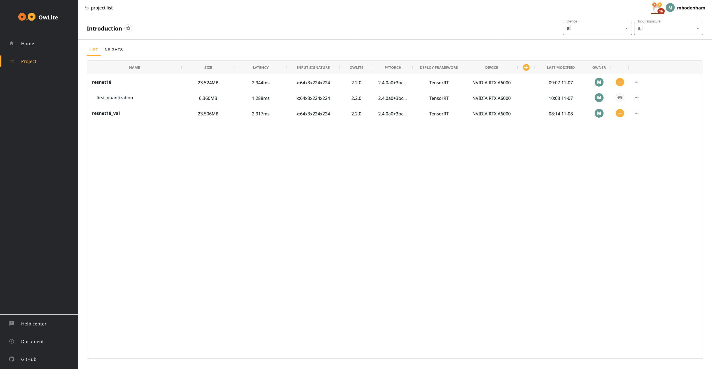

19. Here we can select the accuracy metric, for ImageNet higher is better.

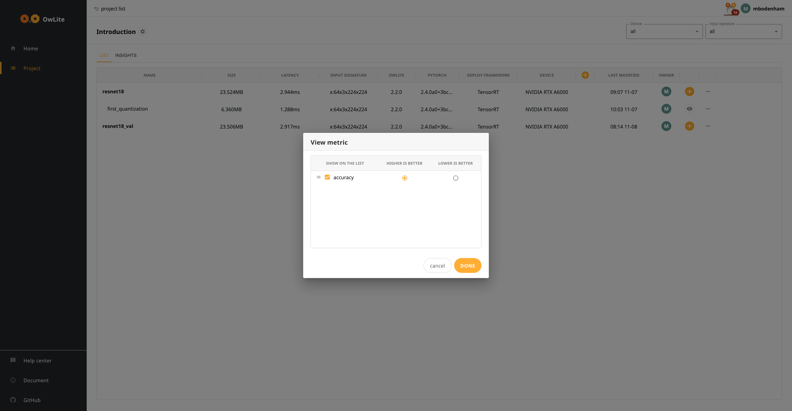

20. Now the model accuracies are displayed on the dashboard.

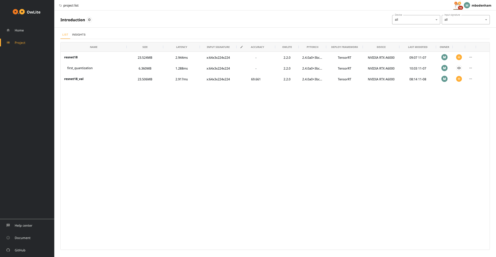

21. The quantized model weights must be calibrated by passing through some training examples to the model using `with owlite.calibrate(model) as calibrate_model:`. [More info](https://squeezebits.gitbook.io/owlite/python-api/owlite.calibrators#function-calibrate).

        with owlite.calibrate(model) as calibrate_model:
                for images, _ in val_loader:
                        calibrate_model(images.to(device))
                        break # One batch is sufficient

22. An experimental model can now be created by repeating steps 6 to 12. Once the code has completed, the results can be compared in the dashboard.

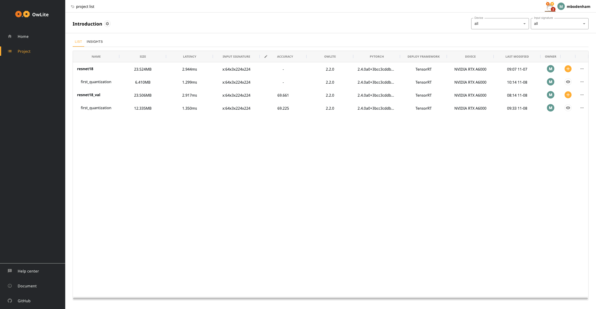

23. The recommended setting produce a **48% reduction in memory** and **2.2x speed up in inference latency** with only a marginal loss is accuracy (<0.5%).

This introduction covers the basic of getting started with OwLite. More advanced examples can be found in this repository.